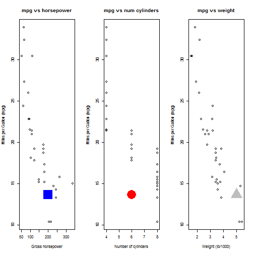

## Executive Summary
mtcars dataset is used. A bestfit model is discovered using regression analysis. Then, mpg (miles per gallon) is predicted for a set consisting of horse power, number of cylindres, and weight of the vehicle. The data is analyzed to find out interesting patterns. Number of cylinders, for example, has only 4, 6, or 8 cylinders.  

### Analysis - Exploratory 
Load data set 'mtcars', and peak at it.

```r
set.seed(12345)      #A random number, used as a good practice, 
data(mtcars)
names(mtcars)
```

```
##  [1] "mpg"  "cyl"  "disp" "hp"   "drat" "wt"   "qsec" "vs"   "am"   "gear"
## [11] "carb"
```

--- 
### Analysis - Exploratory - continuing

```r
summary(mtcars) #the output is suppressed, to comply with page limitations
```

```r
head(mtcars,n=3)
```

```
##                mpg cyl disp  hp drat    wt  qsec vs am gear carb
## Mazda RX4     21.0   6  160 110 3.90 2.620 16.46  0  1    4    4
## Mazda RX4 Wag 21.0   6  160 110 3.90 2.875 17.02  0  1    4    4
## Datsun 710    22.8   4  108  93 3.85 2.320 18.61  1  1    4    1
```
Different Number of Cylinders:

```r
unique(mtcars$cyl)
```

```
## [1] 6 4 8
```
The above information was used to restrict the input for number of cylinders in the Shiny UI. 

---
## Best Fit Model and Predict Function

```r
#find the best regression model of MPG based on horsepower, number of cylinders, and weight
modelFit <- lm(mpg ~ hp + cyl + wt, data=mtcars)
print(modelFit)
```

```
## 
## Call:
## lm(formula = mpg ~ hp + cyl + wt, data = mtcars)
## 
## Coefficients:
## (Intercept)           hp          cyl           wt  
##    38.75179     -0.01804     -0.94162     -3.16697
```

```r
#predicts MPG based on horsepower, number of cylinders, and weight
predictedMPG <- function(horsepower, numcylinders, weigth) {
  modelFit$coefficients[1] + modelFit$coefficients[2] * horsepower + 
    modelFit$coefficients[3] * numcylinders + modelFit$coefficients[4] * weigth
}
```

---
## Test for hp=200, num cyl=6, and weight=5000


